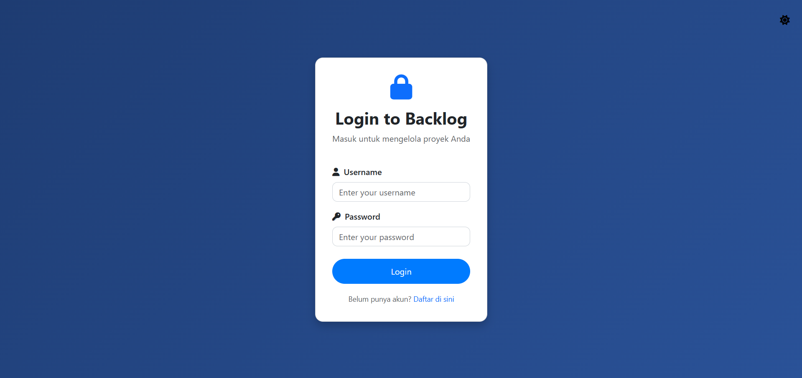
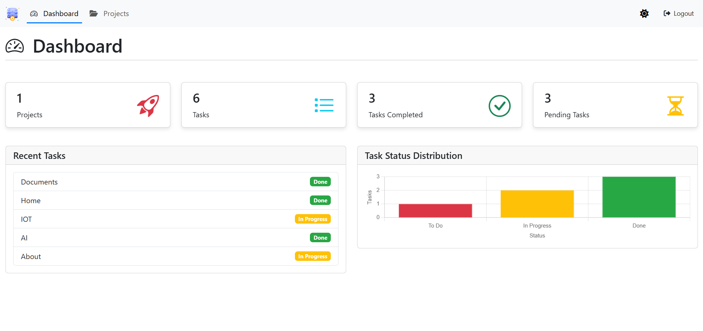
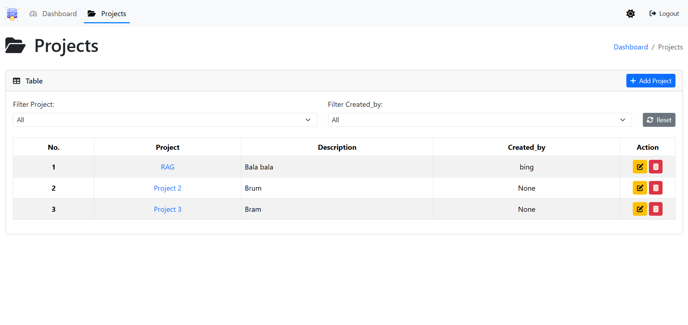
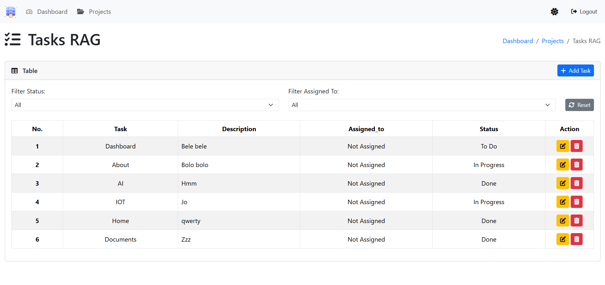

# Backlog Management Application

## Overview
A simple web-based backlog application created using Django Framework and Python.

## Features
- **Dashboard**: Mengamati Project and task.
- **Projects**: Add, edit, and delete project.
- **Project Filtering**: Filter projects and tasks based on project name or created_by.
- **Tasks**: Add, edit, and delete tasks with status updates (To Do, In Progress, Done).
- **Taks Filtering**: Filter projects and tasks based on task name or assigned to.
- **Secure Authentication**: Login and logout features to protect your data.

## How It Works
1. **Dashboard**: Upon login, users are greeted with a dashboard displaying the number of projects, tasks, and completion status.
2. **Projects**: Users can view a table of projects, filter them by creator or project name, and add new projects.
3. **Task Management**: Each project links to a task list where users can manage individual tasks with statuses.
4. **Actions**: Edit or delete projects and tasks with a single click.

## Technologies Used
- **Backend**: Python 3.12, Django 5.1.7
- **Frontend**: HTML, CSS, Bootstrap 5.3.3, Bootstrap Icons, Font Awesome
- **Database**: SQLite (default Django database, can be extended to PostgreSQL/MySQL)
- **Other Tools**: Git, GitHub for version control

## Screenshots

  

---